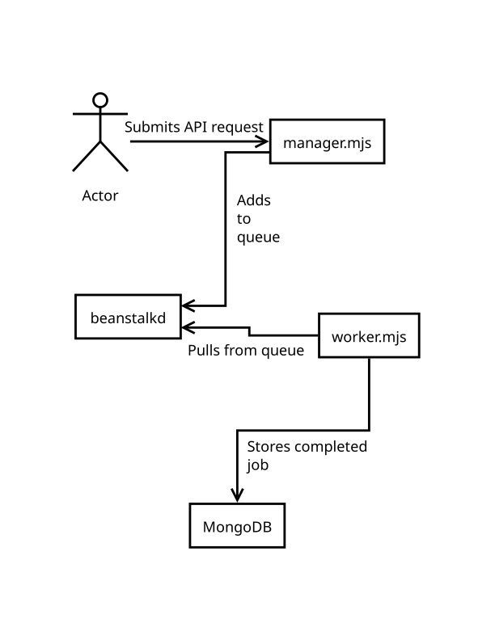
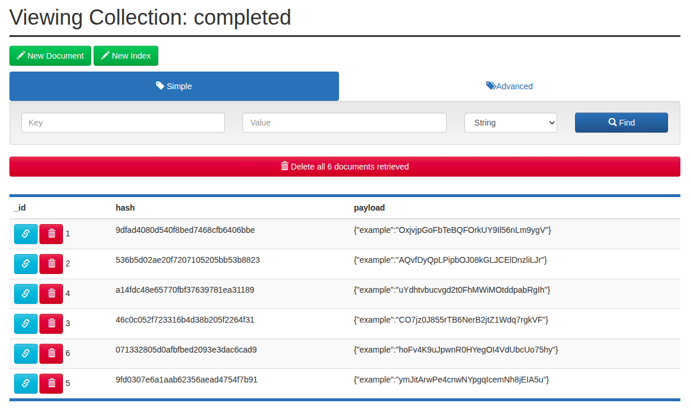
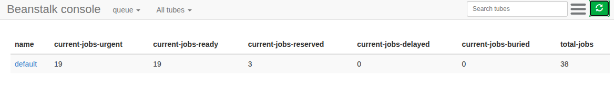

# An Example Distributed System
This project implements a distributed, horizontally scalable distributed system.
Users can send jobs to a RESTful API (implemented over HTTP in `manager.mjs`), and these jobs are inturn run on one or more workers (implemented in `worker.mjs`).
For demonstration purposes, the worker simply hashes the job's JSON payload from an HTTP `POST` and stores it in MongoDB, representing a completed job. The unaltered payload is also stored in MongoDB.
The `manager.mjs` and `worker.mjs` modeule run as seperate processes and communicate indirectly through a beanstalkd queue.

When pulling the status of a job from a `GET` request, `manager.mjs` will first check beanstalkd for the jobs status. If the job is not found in the queue,
`manager.mjs` will then check MongoDB for a completed job, and it will return an appropriate HTTP code and message depending on the job's presence in the database.

`index.js` is used to launch either `manager.mjs` or `worker.mjs`, depending on CLI arguments. This allows for a simplified `Dockerfile` and a simplified `docker-compose.yml`.

The system can be deployed on Docker Swarm to provide an easy, straightforward means of spawning additional worker processes.
Docker Swarm provides an easy-to-use means of deploying highly available applications;
Docker Compose files are used to deploy collections of services called "stacks".

## Utilites
- [Docker Swarm](https://github.com/dockerd/swarm) is a simple cluster management tool to deploy distributed applications. It allows for easy horizontal scaling
by the addition of compute hardware as well as a means to increase the number of `worker.mjs` processes running.
- [beanstalkd](https://beanstalkd.github.io/) is a job/worker queue.
- [jackd](https://github.com/divmgl/jackd) is a beanstalkd client that supports Node.JS. It is a comprehensive module that makes it easy to add jobs to the queue
and process the jobs using the same library.
- [MongoDB](https://github.com/mongodb/mongo) is a NoSQL database that will be used to store job outputs.
- [dotenv](https://github.com/motdotla/dotenv) allows the use of persistent environment variables in a `.env` file;
it allows for easy customization of a local development environment, e.g. changing the MongoDB or beanstalkd endpoint.
- [Mongo Express](https://github.com/mongo-express/mongo-express) provides a web-based visualization and administrative dashboard for MongoDB, and it provides a graphical means to check for completed jobs.
- [Beanstalk console](https://github.com/ptrofimov/beanstalk_console) shows stats about the beanstalkd queue, including the number of jobs in progress.

## Flow


## API
- `POST` -> sending a `POST` request to any endpoint with properly formed JSON as its payload will add a job to the queue
  - e.g. `curl -X POST localhost:8080 -H "Content-Type: application/json" --data '{"example":"data"}'`
- `GET` -> sending a `GET` request with the job's ID in its URL will return the status of the job
  - e.g. `curl -X GET localhost:8080/1/` will return the status of job `1`

## Local Setup
A local setup for development or testing purposes can be created with Docker. Two containers (one for beanstalkd and one for MongoDB) can be run on a local machine.
Each of the below commands can be run in its own terminal tab/window for the sake of ease. Basic scaling can be achieved by running more than one worker process.

To run beanstalkd:
```bash
docker run -it --rm -p 127.0.0.1:11300:11300 rayyounghong/beanstalkd -V
```

To run MongoDB:
```bash
docker run -it --rm -p 127.0.0.1:27017:27017 mongo
```

Start the manager:
```bash
node manager.mjs
```

Start one or more workers:
```bash
node worker.mjs
```

Send an example job:
```bash
curl -X POST localhost:8080 -H "Content-Type: application/json" --data '{"example":"data"}'
```

After sending an example job with cURL, the job's ID will be printed to the console. This ID can then be used to query the job's status:
```bash
curl localhost:8080/1/
```

If the job is waiting in the queue or in progress, the response to the GET request will reflect the details from beanstalkd, e.g.:
```json
{"id":1,"tube":"default","state":"reserved","pri":0,"age":0,"delay":0,"ttr":60,"timeLeft":59,"file":0,"reserves":1,"timeouts":0,"releases":0,"buries":0,"kicks":0}
```

If the job is complete, the response will be fetched from MongoDB, e.g.:
```json
{"_id":1,"hash":"09ee943c4fa33cd5a355eb7a4e38f7ef","payload":"{\"example\":\"data\"}"}
```

## Deployment
Easy scaling can be used in a production environment with Docker Swarm. In ordr to use Docker Swawm effectively, at least three Linux servers are required.
These can be either virtual or dedicated, and various Linux distributions can be used. Alias records should be pointed to each of the servers, and local hostnames
should match these DNS entries.

*Note: The local setup described above does not include disk persistence. This is deliberate for the sake of easy debugging. The below setup includes disk persistence for both in-queue and completed jobs.*

### Serer Setup
Docker Swarm distinguishes two types of servers: managers and workers. This nomenclature should not be confused with the usage of "managers" and "workers"
used in this project, although they are conceptually similar. Docker Swarm's managers are responsible for controlling the state of the swarm; managers in this
project add jobs to the queue. Managers in a Docker Swarm are also workers.

For this demo, we will use a single manager and two workers: `manager.edge-demo.site`, `worker-1.edge-demo.site` and `worker-2.edge-demo.site`. These nodes can be Edge Compute units.
 
To get up and running, install Docker on each of the servers via SSH:
```bash
curl -s https://get.docker.com | bash
```

#### Manager Node
In our setup, the Docker Swarm manager will be the only stateful node. It will be used to coordinate the swarm workers in addition to holding both the beastalkd
queue and MongoDB data.

One the manager node, initalize the swarm:
```bash
docker swarm init
```

The output will look like this:
```
Swarm initialized: current node (bvz81updecsj6wjz393c09vti) is now a manager.

To add a worker to this swarm, run the following command:

    docker swarm join --token SWMTKN-1-3pu6hszjas19xyp7ghgosyx9k8atbfcr8p2is99znpy26u2lkl-1awxwuwd3z9j1z3puu7rcgdbx 172.17.0.2:2377

To add a manager to this swarm, run 'docker swarm join-token manager' and follow the instructions.
```

#### Worker Nodes
The output of `docker swarm init` provides rudimentary instructions on joining a worker to the swarm; run this command on each worker to populate the swarm:
```bash
docker swarm join --token SWMTKN-1-3pu6hszjas19xyp7ghgosyx9k8atbfcr8p2is99znpy26u2lkl-1awxwuwd3z9j1z3puu7rcgdbx 172.17.0.2:2377
```

More information about [initializing a swarm](https://docs.docker.com/reference/cli/docker/swarm/init/) and 
[joining nodes](https://docs.docker.com/reference/cli/docker/swarm/join/) can be found in the official documentation.

### Controlling the Swarm
Managemnt of a Docker Swarm must (naturally) occur on a manager node, so log back in to the manager via SSH.

To check the setup of the swarm, run:
```bash
docker node ls
```

With one manager and two workers, the output should resemble the following:
```
ID                            HOSTNAME                  STATUS  AVAILABILITY   MANAGER STATUS   ENGINE VERSION
aZohnao5Eem2vafaeTh1ohgh5 *   manager.edge-demo.site    Ready   Active         Leader           25.0.3
saeSh9chue6aoqu1ahv3Mah1t     worker-1.edge-demo.site   Ready   Active                          25.0.3
Zoowou7een6aey9eici6Vaiz9     worker-2.edge-demo.site   Ready   Active                          25.0.3
```

### Running the Stack
Still on the manager node, download the Docker Compose file:
```bash
curl -s https://raw.githubusercontent.com/shcorya/distributed-workers/refs/heads/master/docker-compose.yml > docker-compose.yml
```

Note that the number of worker processes can be easily adjusted. The default is three.
```yaml
  worker:
    image: scorya/distributed-workers:development
    command: worker
    networks:
      - internal
    environment:
      <<: *connections
    deploy:
      mode: replicated
      replicas: 3 # <- adjust this to scale the number of workers
```

Deploy the stack:
```bash
docker stack deploy -c ./docker-compose.yml -d demo
```

## Demo
A public-facing demo is set up at `manager.edge-demo.site`.
The RESTful API runs on port `8080`, Mongo Express runs on port `8081`, and a web-based beanstalk dashboard runs on port `8082`.

### Usage
The provided `test.sh` script can be used to add jobs to the queue in bulk. For example, this command
```bash
./test.sh manager.edge-demo.site:8080 128
```
will add 128 jobs to the work queue.

### Visualizations
Completed jobs can be viewed in Mongo Express at [manager.edge-demo.site:8081](http://manager.edge-demo.site:8081). The username is "admin" and the password is "pass".



Numbers related to in-process jobs (numbers ready, delayed, total, etc.) can be viewed in Beanstalk console at
[manager.edge-demo.site:8082](http://manager.edge-demo.site:8082). Note that if the queue
is full, the number of `current-jobs-reserved` is equal to the number of worker processes.

*Note: It may be necessary to refresh the page after loading Beanstalk console.*



## Trade-offs and Limitations

### High Availability
Beanstalkd is not highly available; however, its protocol is simple and can be implemented in a highly available way.
Likewise, MongoDB is not not highly available in the setup outlined within this repository. MongoDB high availability can be achieved using a repilca set and HAProxy. 
Adding Docker Swarm managers is simple and would provide highly available management of processes' states.

### Security
Inter-process communication is encrypted within Docker Swarm; however, for the sake of simplicity, API requests and visualizers are accessed through unencrypted HTTP.
This limitation can be addressed by using [Caddy](https://github.com/caddyserver/caddy) as a reverse proxy, running all currently unencrypted communications through HTTPS.
Caddy could also be used to require authentication for API calls that create jobs.

Caddy automatically gets SSL certificates, and these can be stored in a highly available MongDB/HAProxy setup using a custom compilation of Caddy with [this plugin](https://github.com/root-sector/caddy-storage-mongodb).
Running Caddy as a reverse proxy would require setting additional DNS records, among other things, thus it is omitted for simplicity.

### Beanstalk vs. Bull vs. BullMQ
Bull does not provide a means of separating worker processes as its own module; worker processes must be called from the processes that enqueues the jobs, therefore the processes cannot be completely segregated.
BullMQ addresses this limitation, but both Bull and BullMQ are backed by redis. 

While redis is well-tested and reliable, strongly-consistent, highly-available redis implementations are limited.
Re-implementing every facet of redis used by Bull and BullMQ would be impractical.

Conversely, beanstalk is a simple protocol created specifically for queues. It has been implemented in different languages, and at least one ([Coolbeans](https://github.com/1xyz/coolbeans)) uses RAFT for high availability.

### NoSQL vs SQL
Since the worker module returns a JSON object, it can be more easily stored in MongoDB than a SQL database. The ID of the beanstalk job as well as the _id of each MongoDB objects are both native JavaScript integers.

## Next Steps
1. Fix Master Branch CI/CD
2. Add two more manager nodes to Docker Swarm
3. Create a replica set for MongoDB
4. Use HAProxy so that all requests go to the replica set leader
5. Use Caddy as a reverse proxy, storing certificates in MongoDB
6. Highly available beanstalk queue

## Appendix
- When running the deployment in Docker Swarm, `manager.mjs` can be scaled in addition to `worker.mjs`. Since `manager.mjs` requires an open port, it can only scale to the number of nodes in the swarm.
- With [Coolbeans](https://github.com/1xyz/coolbeans), HAProxy + MongoDB, and two more Docker Swarm manager nodes, the entire system would have no single point-of-failure. (Caddy can be configured with Docker Swarm labels.)
